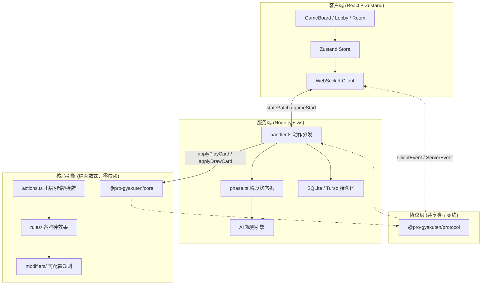
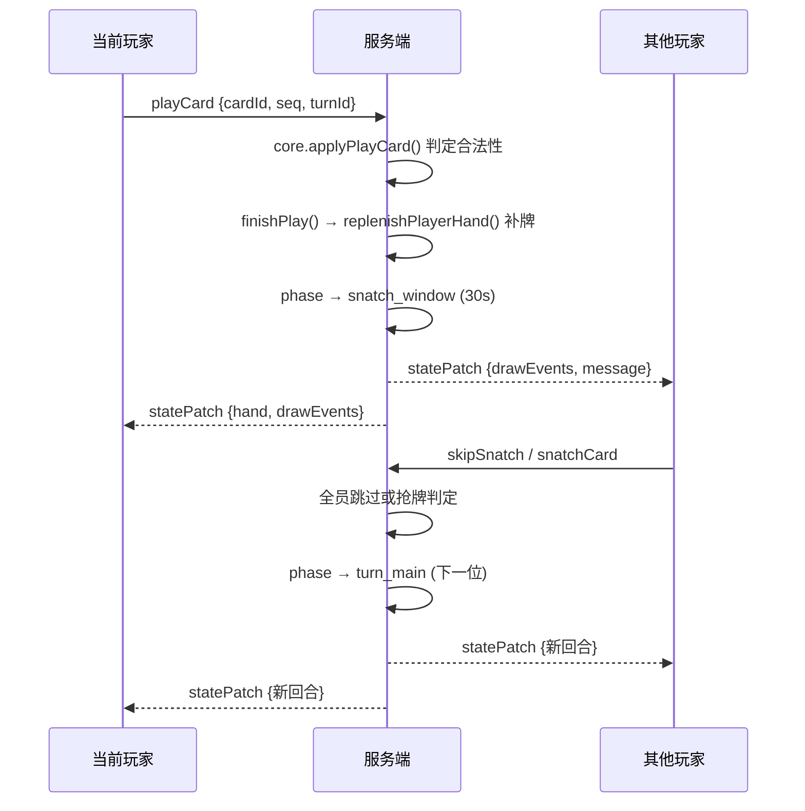
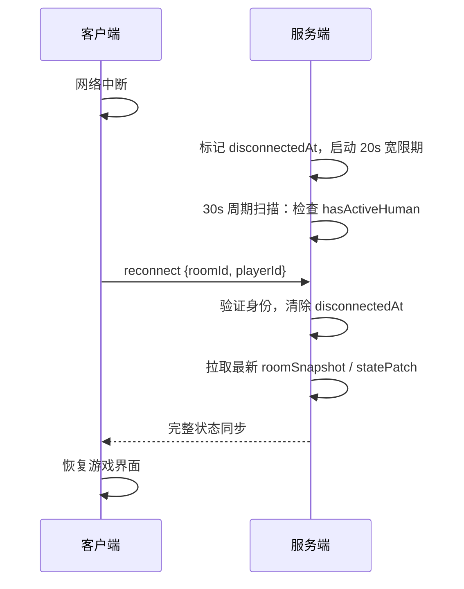

# 逆转 UNO · ProGyakuten

**组队对抗版 UNO 线上卡牌游戏** — 2/4/6 人分两队，队友手牌互见，先出完手牌的队伍获胜。

[](https://github.com/WTJunzhu/ProGyakuten/actions/workflows/ci.yml)
[](LICENSE)

> 🎮 **在线试玩**：`pro-gyakuten-client.vercel.app` — 注册 → 选角色 → 建房间 → 开局

---

## 架构总览



**关键设计**：`@pro-gyakuten/core` 作为纯函数式规则引擎，既被服务端调用来判定合法性、也被客户端通过 Lite 函数做即时 UI 反馈，实现了"一次编写、两端复用"。

---

## 技术亮点

### 🎲 纯函数式规则引擎 + 73 个单元测试
`@pro-gyakuten/core` 零 UI / 网络依赖，所有动作（出牌、抢牌、摸牌、UNO）都是 `(state, params) → ActionResult` 的纯函数。规则变更不影响网络层和 UI 层，可独立移植到移动端 / Electron / C++ 重写。

### 🔄 WebSocket 实时对战 + 断线重连 + 状态快照恢复
长连接通信，服务端权威（客户端只发意图，合法性全在服务端判定）。20 秒断线宽限期 + `roomSnapshot` 快照恢复 + 僵尸房间 30s 周期扫描清理。

### 🛡️ phaseToken / seq / turnId 三重序号防竞态
异步网络下事件可能乱序到达。`phaseToken` 标识阶段窗口、`seq` 单调递增防止重放、`turnId` 标识回合——三重校验确保过期 / 重复事件被安全拒绝。

### 🤖 AI 本地规则引擎（非 LLM），决策延迟 < 50ms
基于局面评估的确定性策略引擎，`strategy.ts` 枚举所有合法决策并按启发式排序。无需 API 调用、无延迟波动、可离线运行、完全可调试。

### 🎯 可配置规则 + Hook 注入的角色技能系统
`GameRuleConfig` 暴露 20+ 可调参数（手牌上限、超时、洗牌种子等），`GameRuleHookSet` 提供 `beforePenaltyDraw` / `afterCardPlayed` / `resolveUnoPenalty` 等 hook 点。3 个原创角色技能通过 hooks 注入，无需改动核心引擎。

---

## 非平凡的游戏机制

不是标准 UNO 复刻，而是自创变体，包含以下创新机制：

| 机制 | 说明 |
|------|------|
| **抢牌窗口** | 出牌后 30s 窗口，其他玩家精确匹配（颜色+种类+数值）可抢夺出牌权 |
| **Wild 组合出牌** | Wild 牌不能单出，须与非 Wild 牌组合并指定颜色 |
| **加牌链 + 反转反弹** | +2 可接 +2/+4/同色反转；+4 只能接 +4/同色反转；反转反弹罚摸方向 |
| **Skip 约束** | 被跳过后，下家只能出同种类牌或 +4 |
| **爆牌判负** | 手牌 ≥ 20 张直接判输，杜绝拖延战术 |
| **补牌机制** | 出牌后若手牌无数牌，自动补摸直到出现数字牌 |

完整规则见 [逆转Uno游戏规则全集.md](逆转Uno游戏规则全集.md)

---

## 技术栈

| 层 | 技术 | 选型理由 |
|----|------|------|
| 前端 | React 19 + Zustand 5 + Vite + TypeScript | Zustand 轻量（1KB），避免 Redux 样板代码 |
| 后端 | Node.js + ws (WebSocket) | 回合制不需要 HTTP 语义，ws 原生双向通信 |
| 规则引擎 | TypeScript 纯函数 | 可测试、可序列化、可跨平台复用 |
| 数据库 | SQLite (本地) / Turso (生产) | `@libsql/client` 统一接口，一套代码两种部署 |
| 包管理 | npm workspaces monorepo | 零额外工具链，protocol/core/server/client 分包 |

---

## 项目结构

```
ProGyakuten/
├── packages/
│   ├── protocol/           # 共享类型契约（ClientEvent / ServerEvent）
│   └── core/               # 纯规则引擎（零依赖，73 个测试）
│       ├── src/actions.ts   # 出牌/抢牌/摸牌/UNO 等动作
│       ├── src/engine/      # 状态机（抽牌、回合推进、序列化）
│       ├── src/rules/       # 各牌种效果 + 出牌合法性判定
│       ├── src/characters/  # 角色技能系统（Hook 注入）
│       └── src/modifiers/   # 可配置规则参数
├── apps/
│   ├── server/              # WebSocket 游戏服务器
│   │   └── src/
│   │       ├── handler.ts   # 动作分发器
│   │       ├── phase.ts     # 阶段状态机（超时驱动自动跳过）
│   │       ├── ai/          # AI 规则引擎（strategy + scheduler）
│   │       ├── broadcast.ts # 差异化广播（队友看牌面、敌方看牌背）
│   │       └── persistence.ts # SQLite/Turso 双写持久化
│   └── client/              # React SPA
│       └── src/
│           ├── components/   # 15 个 UI 组件
│           ├── stores/       # Zustand 状态管理
│           ├── presentation/ # 演出系统（BGM/SFX/视频/聚焦动画）
│           └── audio.ts     # 音频控制器
└── 设计文档（12 份）
```

---

## 快速开始

### 本地开发

```bash
npm install

# 构建（必须按依赖顺序）
npm run build -w @pro-gyakuten/protocol
npm run build -w @pro-gyakuten/core
npm run build -w @pro-gyakuten/server
npm run build -w @pro-gyakuten/client

# 启动服务端 → ws://localhost:3001
npm run dev -w @pro-gyakuten/server

# 启动客户端 → http://localhost:3000
npm run dev -w @pro-gyakuten/client
```

### Docker 一键启动

```bash
docker compose up --build
# 前端 http://localhost:3000  后端 ws://localhost:3001
```

### 测试

```bash
npm test                              # 全量测试
npx vitest run packages/core/tests/   # 73 个核心规则测试
npm run test -w @pro-gyakuten/server  # 持久化 + 服务端测试
```

---

## 出牌时序



---

## 断线重连时序



---

## 部署

| 组件 | 平台 | 说明 |
|------|------|------|
| 前端 | Vercel | 自动构建 + SPA rewrites |
| 后端 | Render (Singapore) | Docker 镜像部署，冷启动 ~30s |
| 数据库 | Turso | libsql 云数据库，边缘复制 |

三个平台均监听 `main` 分支 push 自动部署。

### 环境变量

| 变量 | 用途 | 默认值 |
|------|------|--------|
| `TURSO_URL` | Turso 数据库连接 | `file:gyakuten.db` |
| `TURSO_AUTH_TOKEN` | Turso 认证令牌 | — |
| `VITE_WS_URL` | 客户端 WebSocket 地址 | `ws://localhost:3001` |
| `PORT` | 服务器端口 | `3001` |
| `HOST` | 服务器绑定地址 | `0.0.0.0` |
| `TURN_TIMEOUT_MS` | 出牌超时 | `30000` |
| `SNATCH_WINDOW_TIMEOUT_MS` | 抢牌窗口超时 | `30000` |
| `RECONNECT_GRACE_MS` | 断线宽限期 | `20000` |

---

## 当前功能

### 核心玩法
- ✅ 2/4/6 人组队对抗
- ✅ 抢牌机制（30s 窗口 + 精确匹配）
- ✅ Wild 组合出牌
- ✅ 加牌链（+2/+4 叠加 + 反转反弹）
- ✅ Skip 约束 + 出牌限制
- ✅ UNO 喊牌/检查 + 罚摸
- ✅ 补牌机制（手牌无数牌自动补）
- ✅ 爆牌判负（手牌 ≥ 20 张，队伍直接判负）

### 网络 & 持久化
- ✅ 断线重连（20s 宽限期）
- ✅ 服务器重启恢复（SQLite/Turso 快照）
- ✅ AI 对手自动填充
- ✅ 观战系统
- ✅ 再来一局（game_over → lobby → startGame）

### 聊天 & 通信
- ✅ 队内文字聊天
- ✅ 全员聊天
- ✅ 默认收起 + 未读红点提示

### 账户 & 角色
- ✅ 注册/登录（scrypt 密码加密）
- ✅ 角色系统（每账户 3 槽位，等级/胜负统计）
- ✅ 角色技能系统（3 个原创角色，Hook 注入）

### UI & 体验
- ✅ Mac Dock 风格手牌高斯放大算法
- ✅ 队友手牌点击全屏浏览 + 总量显示
- ✅ 敌人手牌紧凑显示（单张牌背 + 居中数字）
- ✅ 聚焦放大动画（喊 UNO / 加牌链 / 结束）
- ✅ 出牌飞行动画 + 补牌右侧滑入动画
- ✅ 悬浮 UNO 按钮（剩 1 张时弹出，红色脉冲）
- ✅ 回合方向指示器 + 下一位玩家标示
- ✅ 倒计时进度条
- ✅ 聊天框默认收起 + 未读红点
- ✅ BGM 场景切换（15 首）+ SFX 音效
- ✅ 移动端 / 桌面端响应式适配

---

## 设计文档

| 文档 | 内容 |
|------|------|
| [逆转Uno游戏规则全集.md](逆转Uno游戏规则全集.md) | 完整游戏规则形式化 |
| [演出系统设计文档.md](演出系统设计文档.md) | 演出层架构（BGM/SFX/视频/背景） |
| [AI对手系统设计文档.md](AI对手系统设计文档.md) | AI 规则引擎设计 |
| [聊天系统设计文档.md](聊天系统设计文档.md) | 队内/全员聊天 |
| [观战系统设计文档.md](观战系统设计文档.md) | 观战功能 |
| [角色系统设计文档.md](角色系统设计文档.md) | 角色技能系统 |
| [好友系统设计文档.md](好友系统设计文档.md) | 好友系统 |
| [前端优化说明.md](前端优化说明.md) | 前端优化待办清单 |
| [重构优化策略.md](重构优化策略.md) | 重构方法论 |
| [docs/deployment-and-guidelines.md](docs/deployment-and-guidelines.md) | 部署记录 & 开发规范 |
| [docs/benchmark.md](docs/benchmark.md) | 性能压测报告 |
| [docs/netcode_notes.md](docs/netcode_notes.md) | 网络模型笔记 |

---

## 开发注意事项

1. **import 扩展名**：`apps/server` 和 `packages/*` 的相对 import 必须带 `.js` 后缀（Node16 ESM），`apps/client` 不需要（Vite Bundler）
2. **构建顺序**：protocol → core → server → client，不可调换
3. **推送**：必须获得明确允许才能 push 到 main
